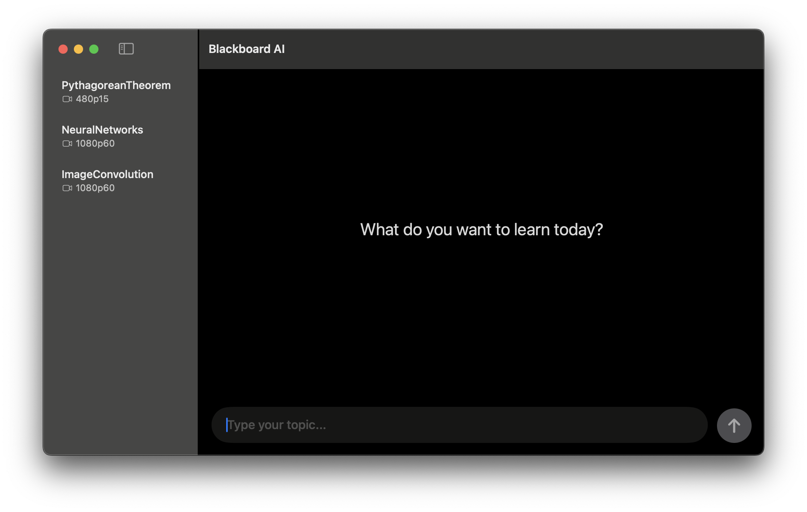
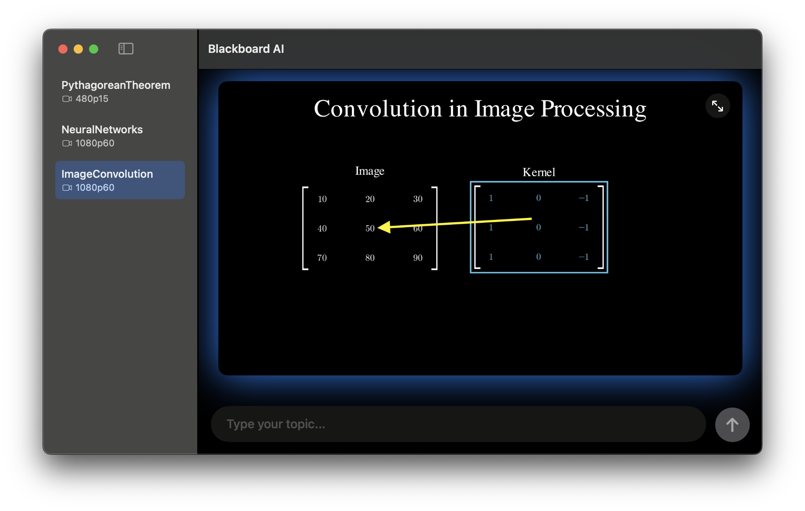

# Blackboard AI 🎓: AI-Powered Educational Video Creation

<p align="center">
  
</p>

<p align="center">
  <em>Blackboard AI - Educational content creation with AI, Manim, and TTS</em>
</p>

> **🚧 Project Status: In Active Development**  
> Blackboard AI is currently under active development. While core functionality is working, features are being refined and new capabilities are being added regularly. Expect frequent updates and improvements!

**Blackboard AI** is an innovative educational content creation tool that automatically generates narrated mathematical videos using the power of AI. By combining OpenAI's ChatGPT, Manim (Mathematical Animation Engine), and advanced Text-to-Speech technology, Blackboard AI transforms educational concepts into engaging visual explanations.

## ✨ Features

- 🤖 **AI-Powered Content Generation**: Leverages OpenAI's GPT models to create educational scripts and mathematical explanations
- 📊 **Mathematical Animations**: Uses Manim to generate beautiful, precise mathematical visualizations
- 🎙️ **Text-to-Speech Integration**: Converts generated scripts into natural-sounding narration
- 🎬 **Automated Video Production**: Seamlessly combines animations with voiceover to create complete educational videos
- 🖥️ **macOS Desktop App**: Native macOS application with intuitive user interface
- 📚 **Educational Focus**: Specifically designed for mathematical and scientific content creation

## 🚀 Getting Started

> **⚠️ Development Notice**  
> This project is currently in development. Installation and setup processes may change as the project evolves. Check back for updates and stable releases.

### Prerequisites

- macOS (for the desktop app)
- Xcode (for development)
- OpenAI API key

### Installation (Development Version)

1. **Clone the repository**
   ```bash
   git clone https://github.com/yourusername/blackboard.git
   cd blackboard
   ```

2. **Open in Xcode**
   ```bash
   open "Blackboard AI/Blackboard AI.xcodeproj"
   ```

3. **Set up your OpenAI API key**
   - Run the application from Xcode
   - Go to Settings within the app
   - Add your OpenAI API key

4. **Build and run**
   - Use Xcode to build and run the application

### 📦 Releases

**Coming Soon!** I'm working on packaging Blackboard AI for easier installation:
- macOS App Bundle (.app) - *In Development* (will include Python environment)
- Web Application - *Planned* (after Aether framework development)
- Windows Executable - *Planned* (after Aether framework development)

Watch this repository for release announcements!

<p align="center">
  
</p>
<p align="center">
  <em>Example: Image Convolution explanation with mathematical animations</em>
</p>

## 🎯 How It Works

1. **Input Your Topic**: Provide a mathematical concept or educational topic you want to explain
2. **AI Script Generation**: ChatGPT generates a comprehensive script with mathematical explanations
3. **Animation Creation**: Manim creates corresponding visual animations and mathematical diagrams
4. **Voice Synthesis**: Text-to-Speech converts the script into natural narration
5. **Video Assembly**: All components are automatically combined into a final educational video

## ️ Core Components

### Engine.py
The heart of Blackboard AI that orchestrates:
- AI content generation and prompt management
- Manim scene creation and rendering
- Text-to-Speech processing
- Video compilation pipeline

### OpenAI.swift
Handles OpenAI API integration:
- GPT model communication
- API key management
- Content generation requests

### Desktop Application
Built with Swift and SwiftUI, providing:
- Intuitive user interface
- Real-time preview capabilities
- Project management
- Export options

## 🎨 Example Use Cases

- **Mathematical Proofs**: Generate step-by-step visual proofs with narration
- **Scientific Concepts**: Create explanatory videos for physics, chemistry, or biology topics
- **Educational Tutorials**: Produce comprehensive learning materials for students
- **Lecture Supplements**: Enhance traditional lectures with engaging visual content

## 📄 License

This project is licensed under the [MIT License](LICENSE).

This project incorporates third-party open-source software:
- **Manim**: [MIT License](https://github.com/ManimCommunity/manim/blob/main/LICENSE)
- **Coqui TTS**: [MPL-2.0 License](https://github.com/coqui-ai/TTS/blob/main/LICENSE.txt)
- **PythonKit**: [Apache License 2.0](https://github.com/pvieito/PythonKit/blob/master/LICENSE.txt)
- **OpenAI API**: Usage governed by [OpenAI's Terms of Use](https://openai.com/policies/terms-of-use)

## 🙏 Acknowledgments

- **Manim**: For providing the mathematical animation framework
- **OpenAI**: For powering the AI content generation
- **Swift Community**: For the excellent UI development tools

## 📞 Support

If you encounter any issues or have questions, please:
- Open an issue on GitHub
- Check existing issues for known problems
- Join our discussions for feature requests and general questions

> **Note**: As this is an active development project, documentation and features may change. I appreciate your patience and feedback as I work to improve Blackboard AI!

---

**Made with ❤️ for educators and learners worldwide**

*⭐ Star this repository to stay updated on my progress!*
